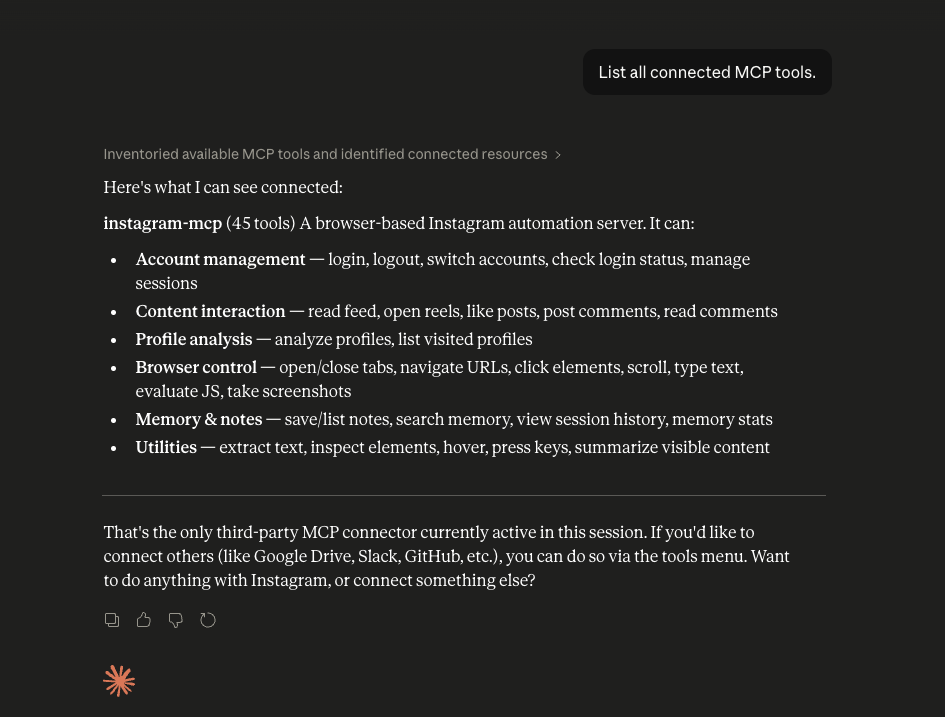
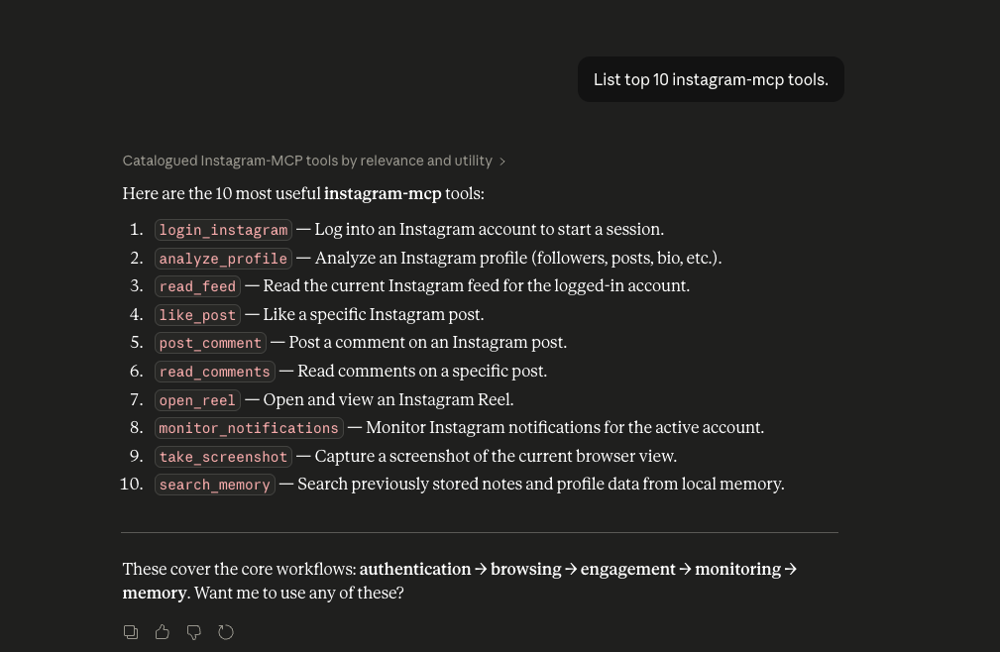

# 🤖 Instagram MCP — Local Browser Automation Server

<p align="center">
  
</p>

<p align="center">
  <strong>Local-first Instagram automation for Claude Desktop, Gemini CLI, Cursor, and Antigravity.</strong>
</p>

<p align="center">
  
  
  
  
  
</p>

---

## ✨ Demo

### MCP Connected in Claude Desktop


### Available Instagram Automation Tools



---

# 🚀 What Is This?

Instagram MCP is a fully local browser automation server built with:

- FastMCP
- Playwright
- SQLite

It allows AI assistants like:

- Claude Desktop
- Gemini CLI
- Cursor
- Antigravity

to control a real browser session and automate Instagram safely using isolated local browser sessions.

No cloud APIs.  
No Instagram passwords stored.  
No external backend required.

---

# 🏗 Architecture

```text
Claude Desktop / Gemini CLI / Cursor / Antigravity
             ↓  MCP Protocol (stdio)
         server.py  ←─── FastMCP
             ↓
    browser_controller.py  ←─── Playwright
             ↓
    instagram_tools.py
             ↓
   Real Chrome or Brave Browser
             ↓
   Logged-in Instagram Session
             ↓
   memory.py  ←─── SQLite (local)
````

---

# 🔥 Features

## Browser Automation

| Tool              | Description             |
| ----------------- | ----------------------- |
| `open_browser`    | Launch browser          |
| `open_url`        | Navigate to any URL     |
| `click_element`   | Click by selector       |
| `type_text`       | Type into fields        |
| `scroll_page`     | Scroll pages            |
| `hover_element`   | Hover elements          |
| `press_key`       | Simulate keyboard input |
| `switch_tab`      | Switch tabs             |
| `close_tab`       | Close tabs              |
| `list_tabs`       | List open tabs          |
| `current_url`     | Get active URL          |
| `page_title`      | Get page title          |
| `extract_text`    | Extract page text       |
| `inspect_element` | Inspect DOM elements    |
| `take_screenshot` | Capture screenshots     |
| `new_tab`         | Open new tabs           |
| `evaluate_js`     | Execute JavaScript      |

---

## Instagram Automation

| Tool                        | Description         |
| --------------------------- | ------------------- |
| `open_instagram`            | Open Instagram      |
| `login_instagram`           | Start login flow    |
| `check_login_status`        | Verify manual login |
| `read_feed`                 | Read home feed      |
| `open_reel`                 | Open reels          |
| `read_comments`             | Read comments       |
| `like_post`                 | Like posts          |
| `post_comment`              | Comment on posts    |
| `monitor_notifications`     | Read notifications  |
| `analyze_profile`           | Analyze profiles    |
| `summarize_visible_content` | Summarize page      |

---

## Multi-Account Management

| Tool                     | Description            |
| ------------------------ | ---------------------- |
| `list_accounts`          | List saved accounts    |
| `switch_account`         | Switch accounts        |
| `current_account`        | Show active account    |
| `logout_current_account` | Logout current account |
| `remove_account`         | Remove saved account   |
| `rename_account_alias`   | Rename account alias   |

---

## Memory System (SQLite)

| Tool                    | Description           |
| ----------------------- | --------------------- |
| `memory_stats`          | Database statistics   |
| `list_screenshots`      | Saved screenshots     |
| `list_visited_profiles` | Visited profiles      |
| `save_note`             | Save notes            |
| `list_notes`            | List notes            |
| `search_memory`         | Search stored content |
| `session_history`       | Session history logs  |

---

# 🔐 Authentication Model

Instagram MCP uses a secure manual-login session model.

Workflow:

1. MCP opens a dedicated automation browser
2. User logs in manually
3. Session cookies are saved locally
4. Future launches automatically reuse the session

No passwords are stored.
No credentials are written to disk.
No personal browser profiles are modified.

---

# 🗂 Project Structure

```text
instagram-mcp/
├── server.py
├── browser_controller.py
├── instagram_tools.py
├── session_manager.py
├── memory.py
├── config.py
├── logger.py
├── requirements.txt
├── pyproject.toml
├── README.md
├── HowToUse.md
├── setup.py
├── quick_setup.sh
├── quick_setup.bat
├── configs/
│   ├── claude_desktop_config.json
│   ├── cursor_mcp_config.json
│   ├── gemini_cli_config.json
│   └── antigravity_config.json
├── data/
│   ├── sessions/
│   ├── screenshots/
│   └── memory.db
└── logs/
```

---

# ⚡ Quick Start

## macOS / Linux

```bash
git clone https://github.com/Devdas-gupta/instagram-mcp.git

cd instagram-mcp

chmod +x quick_setup.sh

./quick_setup.sh
```

---

## Windows

```powershell
git clone https://github.com/Devdas-gupta/instagram-mcp.git

cd instagram-mcp

quick_setup.bat
```

---

# 🧠 Setup Flow

The installer automatically:

* detects Python
* creates `.venv`
* installs dependencies
* installs Playwright
* verifies startup
* generates MCP configs
* prepares Claude Desktop integration

---

# 🔌 Claude Desktop Integration

After setup:

1. Open Claude Desktop config
2. Paste generated MCP config
3. Restart Claude Desktop
4. Instagram MCP tools appear automatically

---

# 🔄 Login Flow

1. Ask Claude to open Instagram
2. MCP opens isolated automation browser
3. Login manually in that browser
4. Say:

   * `done`
   * or `I am logged in`
5. Session saves automatically

Future launches reuse the saved session.

---

# 🖥 Cross Platform Support

Supported platforms:

* macOS
* Windows

Supported browsers:

* Chrome
* Brave

---

# 🛡 Security

* No password storage
* No telemetry
* No cloud sync
* No external APIs
* Local-only execution
* Isolated browser profiles
* Separate sessions per account
* Runtime data excluded via `.gitignore`

---

# ⚠️ Responsible Use

This tool controls a real browser session.

Please:

* Avoid spam automation
* Respect Instagram rate limits
* Avoid abusive behavior
* Use delays between actions
* Monitor automation carefully

Users are responsible for complying with platform rules and local laws.

---

# 📦 Tech Stack

* Python 3.11+
* FastMCP
* Playwright
* SQLite
* Rich
* asyncio

---

# 🧪 Current Status

Current release:

* Early production / beta quality

The architecture includes:

* session isolation
* multi-account management
* cross-platform portability
* stdio-safe MCP transport
* venv-first runtime
* isolated Playwright profiles

---

# 🛣 Roadmap

Planned future improvements:

* TikTok provider
* X/Twitter provider
* YouTube provider
* LinkedIn provider
* Better stealth system
* Browser attachment mode
* AI workflow presets
* Advanced reporting system

---

# 🤝 Contributing

Pull requests, fixes, and ideas are welcome.

Please:

* open issues
* suggest improvements
* share workflows
* improve tooling

---

# ⚠️ Disclaimer

This project is not affiliated with Instagram or Meta.

This repository is provided for:

* educational use
* research
* local automation experimentation

Use responsibly.

---

# 📄 License

MIT License

See:
[LICENSE](./LICENSE)

---

# ⭐ Support The Project

If this project helped you:

* Star the repository
* Share the project
* Open issues
* Contribute improvements


